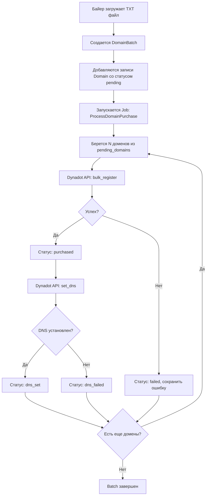
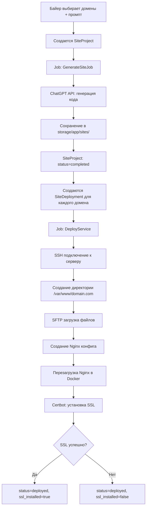

# 🌐 Domain Management System

> **Автоматизированная платформа для массовой покупки доменов и развертывания сайтов**

---

## 📋 Краткое описание

Domain Management System - это комплексное решение для автоматизации работы с доменами: от покупки до полного развертывания готового сайта. Платформа позволяет за несколько кликов купить сотни доменов, сгенерировать для них уникальный контент и автоматически задеплоить на ваши сервера с полной настройкой (Nginx + SSL).

---

## 🎯 Основной функционал

### 🛒 Фаза 1: Автоматическая покупка доменов

| Возможность | Описание |
|------------|----------|
| **Массовая загрузка** | Загрузка списка доменов из TXT файла |
| **Batch обработка** | Покупка N доменов за один запрос (настраивается) |
| **Dynadot API** | Автоматическая регистрация через API |
| **DNS конфигурация** | Автоматическая привязка к вашим серверам |
| **Real-time прогресс** | Отслеживание статуса каждого домена в реальном времени |
| **Умная очередь** | Повторные попытки при ошибках |

**Процесс:**
```
📄 TXT файл с доменами
    ↓
🔄 Создание batch (пачки)
    ↓
💳 Автоматическая покупка через Dynadot
    ↓
🌐 DNS → указывает на ваш сервер
    ↓
✅ Домен готов к использованию
```

---

### 🚀 Фаза 2: Генерация и деплой сайтов

| Возможность | Описание |
|------------|----------|
| **ChatGPT генерация** | Создание полного кода сайта по промпту |
| **Библиотека промптов** | Готовые шаблоны (казино, e-commerce, landing pages) |
| **Один код → много доменов** | Экономия времени и API токенов |
| **Автоматический деплой** | SSH/SFTP загрузка файлов на сервера |
| **Nginx конфигурация** | Автоматическое создание конфигов для каждого домена |
| **SSL сертификаты** | Let's Encrypt установка для всех доменов |
| **Multi-server** | Распределение доменов по разным серверам |

**Процесс:**
```
📝 Выбор промпта
    ↓
🤖 ChatGPT генерирует код (HTML/CSS/JS)
    ↓
💾 Сохранение в Storage
    ↓
📤 Деплой на выбранные домены
    ↓
⚙️ Настройка Nginx для каждого домена
    ↓
🔒 Установка SSL (Let's Encrypt)
    ↓
✅ Сайты работают на всех доменах
```

---

## 👥 Роли и права доступа

### 🔑 Супер Админ

**Доступ к:**
- ⚙️ Глобальные настройки (API ключи Dynadot, OpenAI)
- 🖥️ Управление серверами (добавление, SSH доступы, ключи)
- 👤 Управление байерами (создание, редактирование, удаление)
- 📝 Управление промптами для ChatGPT
- 📊 Полные отчеты и статистика по всем байерам
- 📜 Activity logs (аудит всех действий)

### 💼 Байер

**Доступ к:**
- 📊 Персональный dashboard со статистикой
- 📄 Загрузка доменов из TXT файла
- 🛒 Запуск процесса покупки доменов
- 📋 Просмотр своих доменов (статусы, прогресс)
- 🌐 Генерация и деплой сайтов на свои домены
- 📈 Отслеживание прогресса генерации и деплоя

---

## 🏗️ Техническая архитектура

### **Backend Stack**

```
┌─────────────────────────────────────┐
│         Laravel 12 (PHP 8.2)        │
├─────────────────────────────────────┤
│  • MVC Architecture                 │
│  • Queue System (Redis/Database)    │
│  • Job Processing                   │
│  • Eloquent ORM                     │
│  • Middleware & Auth                │
└─────────────────────────────────────┘
```

### **Infrastructure**

| Компонент | Технология | Назначение |
|-----------|-----------|-----------|
| **Web Server** | Nginx | Reverse proxy, статика |
| **App Server** | PHP-FPM 8.2 | Обработка PHP кода |
| **Database** | MySQL 8.0 | Хранение данных |
| **Queue Worker** | Laravel Queue | Фоновые задачи |
| **Containerization** | Docker Compose | Изоляция и развертывание |
| **Admin Panel** | phpMyAdmin | Управление БД |

### **External APIs**

| API | Назначение | Использование |
|-----|-----------|--------------|
| **Dynadot API** | Покупка доменов | Bulk register, DNS management |
| **OpenAI API** | Генерация контента | ChatGPT (gpt-4, gpt-3.5-turbo, o1, gpt-5) |

### **Deployment Tools**

| Инструмент | Назначение |
|-----------|-----------|
| **phpseclib3** | SSH/SFTP соединения |
| **Certbot** | SSL сертификаты (на целевых серверах) |
| **Docker** | Контейнеризация сайтов (на целевых серверах) |

---

## 🗄️ Структура базы данных

### **Основные таблицы**

| Таблица | Описание | Ключевые поля |
|---------|----------|--------------|
| `users` | Пользователи системы | role (admin/buyer), email, password |
| `servers` | Целевые сервера | ip, ssh_user, ssh_password, ssh_private_key |
| `settings` | Глобальные настройки | dynadot_api_key, chatgpt_api_key, chatgpt_model |
| `activity_logs` | Журнал действий | user_id, action, details, timestamp |

### **Модуль доменов**

| Таблица | Описание | Ключевые поля |
|---------|----------|--------------|
| `domain_batches` | Пачки доменов | buyer_id, server_id, status, pending_domains (JSON) |
| `domains` | Купленные домены | domain_name, status, batch_id, purchased_at, dns_set_at |

### **Модуль генерации сайтов**

| Таблица | Описание | Ключевые поля |
|---------|----------|--------------|
| `prompts` | Шаблоны для ChatGPT | name, prompt_text, language, category |
| `site_projects` | Сгенерированные сайты | prompt_id, status, generated_code_path |
| `site_deployments` | Деплои на домены | site_project_id, domain_id, status, ssl_installed |
| `domain_deployments` | Настройки доменов | domain_id, keitaro_url, offer_url, black_site_id |

---

## 🔄 Бизнес-процессы

### **Процесс 1: Покупка доменов**



### **Процесс 2: Генерация и деплой**



---

## 🎨 Ключевые фичи

### ✨ Умная очередь доменов

- **Batch Processing** - обработка доменов пачками (настраиваемый размер)
- **Auto Retry** - автоматические повторные попытки при сбоях
- **Fail Handling** - сохранение ошибок для каждого домена
- **Target Count** - возможность указать целевое количество успешных покупок

### 🎯 Гибкая генерация

- **Multi-Model Support** - поддержка разных моделей ChatGPT (gpt-4, gpt-3.5-turbo, o1, gpt-5)
- **Prompt Library** - библиотека готовых промптов с категориями
- **One-to-Many** - один сгенерированный сайт на множество доменов
- **Code Storage** - хранение сгенерированного кода для повторного использования

### 🔐 Безопасность

- **SSH Key Auth** - поддержка авторизации по SSH ключам
- **Encrypted Credentials** - безопасное хранение паролей и ключей
- **Activity Logging** - журналирование всех действий пользователей
- **Role-based Access** - разграничение прав доступа

### 📊 Мониторинг и отчетность

- **Real-time Progress** - отслеживание прогресса в реальном времени
- **Detailed Logs** - подробные логи для каждого домена и деплоя
- **CSV Export** - экспорт отчетов в CSV
- **Фильтры** - гибкая фильтрация по датам, статусам, байерам

---

## 🚀 Сценарии использования

### **Сценарий 1: Арбитраж трафика**

```
Задача: Запустить 100 лендингов для тестирования офферов

1. Админ создает промпт "Landing page казино"
2. Байер загружает 100 доменов из файла
3. Система покупает домены и настраивает DNS
4. Байер выбирает все домены + промпт
5. ChatGPT генерирует лендинг
6. Система деплоит на все 100 доменов
7. Устанавливается SSL для каждого
8. Настраивается редирект через Keitaro

Результат: 100 готовых лендингов за 10-15 минут
```

### **Сценарий 2: SEO-сеть**

```
Задача: Создать сеть из 500 сателлитов для продвижения

1. Админ создает промпт "Информационный блог о технологиях"
2. Байер загружает 500 доменов
3. После покупки выбирает 100 доменов
4. Генерирует первый сайт и деплоит на 100 доменов
5. Создает еще 4 промпта с разным контентом
6. Деплоит на оставшиеся 400 доменов (по 100 на каждый)

Результат: 500 уникальных сайтов на разных доменах
```

### **Сценарий 3: Дорвеи**

```
Задача: Массовое создание дорвеев для партнерок

1. Админ настраивает промпты для разных ниш
2. Байер покупает домены пачками по 50 штук
3. Для каждой пачки выбирает промпт по нише
4. Генерация + деплой
5. Настройка редиректов на партнерские ссылки

Результат: Автоматизация создания дорвеев
```

---

## 📦 Развертывание

### **Локальная установка (Dev)**

```bash
# 1. Клонировать проект
git clone <repo> domain_management && cd domain_management

# 2. Настроить .env
cp .env.example .env
nano .env  # указать DB_PASSWORD

# 3. Запустить Docker
docker compose up -d

# 4. Установить зависимости
docker compose exec app composer install

# 5. Настроить Laravel
docker compose exec app php artisan key:generate
docker compose exec app php artisan migrate
docker compose exec app php artisan db:seed
```

**Доступ:** http://localhost:8080  
**Логин:** admin@admin.com / password

### **Production установка**

См. подробную инструкцию: [INSTALL.md](INSTALL.md)

---

## 🔧 Требования

### **Для Control Panel (эта система):**

- Docker + Docker Compose
- 2 GB RAM минимум
- 10 GB диск
- Доступ к портам 8080, 3307

### **Для целевых серверов (где будут сайты):**

- Ubuntu 20.04+ / Debian 11+
- 1 GB RAM минимум
- 20 GB диск
- Порты 22, 80, 443 открыты
- Docker установлен
- Certbot установлен

### **API ключи:**

- **Dynadot API Key** - для покупки доменов
- **OpenAI API Key** - для генерации сайтов

---

## 📈 Производительность

| Метрика | Значение |
|---------|----------|
| **Покупка доменов** | До 50 доменов за 1 запрос |
| **Генерация сайта** | 2-5 минут (зависит от модели) |
| **Деплой на 1 домен** | 30-60 секунд |
| **SSL установка** | 10-30 секунд на домен |
| **Параллельные деплои** | До 10 одновременно (настраивается) |

---

## 📚 Документация

| Файл | Описание |
|------|----------|
| [README.md](README.md) | Основная документация |
| [INSTALL.md](INSTALL.md) | Подробная инструкция по установке |
| [SERVER_SETUP.md](SERVER_SETUP.md) | Настройка целевых серверов |
| [PROJECT_OVERVIEW.md](PROJECT_OVERVIEW.md) | Этот файл - обзор проекта |

---

## 🎯 Roadmap (возможные улучшения)

- [ ] Поддержка других регистраторов (Namecheap, GoDaddy)
- [ ] Интеграция с другими AI моделями (Claude, Gemini)
- [ ] Автоматическое заполнение контентом (парсинг, рерайт)
- [ ] A/B тестирование лендингов
- [ ] Аналитика и отслеживание конверсий
- [ ] Telegram бот для уведомлений
- [ ] API для интеграции с внешними системами

---

## 📞 Поддержка

При возникновении вопросов или проблем:

1. Проверьте [INSTALL.md](INSTALL.md) и [SERVER_SETUP.md](SERVER_SETUP.md)
2. Проверьте логи: `docker compose logs -f`
3. Проверьте логи Laravel: `storage/logs/laravel.log`
4. Проверьте статус очереди: `docker compose exec app php artisan queue:failed`

---

<div align="center">

**🌐 Domain Management System**  
*Автоматизация работы с доменами от покупки до деплоя*

---

Made with ❤️ using Laravel

</div>
